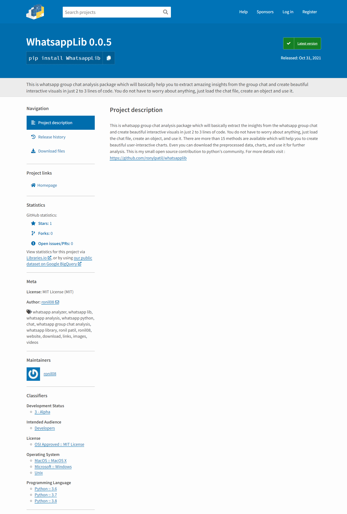
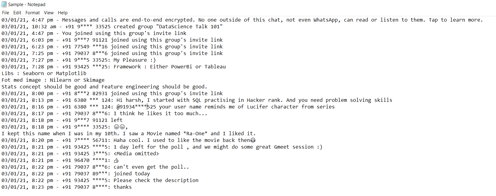

# WhatsApp-Analysis Package

##### Profile Visits :
 

<p align="center">
  
</p>

As the name suggest <b>WhastsApp-Analyzer</b>, it is Whatsapp Group Chat analysis package. It will basically 
help the programmers to generate <b>visual insights</b> from the whatsapp group chat. You need to do nothing, just 
export the group chat and use this package to generate or create beautiful different-different charts.
Here you do not have to worry about anything, internally it will do everything for you. It will perform <b>ETL(Extract-Transform-Load)</b> and finally generate insights
in the form of visuals. There are approx. more than 15 methods are available which will help you to generate insights, even you can download each and every insight. 

Link : https://pypi.org/project/WhatsappLib/0.0.5/

<b>The methods are listed below :</b>
* <b>basicStats : </b> It will return some basic stats of group. Such as total users, total messages, total media messages and total link shared.
* <b>wordCloud : </b> It will create a word cloud, through which we can easily understand the most frequent words used in chat.
* <b>mostActiveUsers : </b> It will create a bar chart for the top-10 most active members in the group.
* <b>mostActiveDay : </b> It will create a bar chart to show traffic on whatsapp group at each weekdays.
* <b>topMediaContributor : </b> It will create bar chart to show top-10 media contributers in the group.
* <b>maxWordContributers : </b> It will create bar chart which will show top-10 authors who used max no. of words in their messages.
* <b>maxURLContributers : </b> It will create bar chart to show top-10 url contributers in the group.
* <b>mostActiveTime : </b> It will create bar chart to show the time at which group was highly active.
* <b>mostSuitableHours : </b> It will create a bar chart to show the best time span at which there may be high chances getting responce from other group members.
* <b>wordCloud_in : </b> It will create word cloud of particular individual. You need to just pass user name.
* <b>highlyActiveDates : </b> It will create a bar chart to show highly active top-15 dates.
* <b>timeseriesAnalysis : </b> It will plot user interactive time-series plot on traffic at each day.
* <b>activeMonthsB : </b> It will create a bar chart to show most active months on which group was highly active.
* <b>maxEmojiUsers : </b> This will plot a bar chart to show top-15 users who used max no. of emojis in group.
* <b>trafficPerYear : </b> It will plot a bar chart to show traffic on group per year.
* <b>activeMonthsT : </b> This will create a timeseries plot to show traffic on group per month.
* <b>weekdaysTraffic : </b> It will create heat map to show the weekdays traffic along with time span.
* <b>topEmojis_G : </b> It will return pandas dataframe of top-20 emojis used by users.
* <b>topEmojis_I : </b> It will return top-10 emjois used by individual user.
* <b>saveDatframe : </b> It will save the preprocessed data as csv file.

## Installation
Use the package manager pip to install all the requirements. Just follow the commands below :
```bash
pip install WhatsappLib==0.0.5
```

<p align="center">
  
</p>

## Note
<b>Remember :</b> Your data must be in the format as mention below, if not, then try to transform your data in given format. And ya, If your time period is specified as <b>AM'&'PM'</b> format then you need to change them in lower case <b>'am'&'pm'</b> format. I will fix this issue and update this package ASAP.
<div style="border: 1px solid black;"><center>
<p align="center">
  
</p></div>
 

## Examples
```python
# importing the required libraries
from WhatsappLib.whatsapplib.preprocess import analysis

# you need to do just one simple step, create object of Analyzer class and pass location-
# of directory as parameter which is mendatory.
obj = analysis(r'*\Sample.txt')

# Now use this reference variable (obj) to access this methods.
total_users, total_messages, media_messages, links = obj.basicStats()      # it is returning 4 parameters
print('Total No. of users : ', total_users)
print('Total No. messages sent : ', total_messages)
print('Total No. of media messages sent : ', media_messages)
print('Total No. of link shared : ', links)

obj.wordCloud_in(user='+91 83900 8', save_fig='y')
obj.mostActiveUsers(save_fig='y')
obj.mostActiveDay(save_fig='y')
obj.topMediaContributor(save_fig='N')
obj.maxWordContributers(save_fig='y')
obj.maxURLContributers(save_fig='N')
obj.mostActiveTime()
obj.mostSuitableHours(save_fig='y')
obj.highlyActiveDates(save_fig='N')
obj.timeseriesAnalysis(save_fig='y')
obj.activeMonthsB(save_fig='N')
obj.maxEmojiUsers(save_fig='y')
obj.activeMonthsT()
obj.trafficPerYear(save_fig='N')
obj.weekdaysTraffic(save_fig='y')
top_emojis = obj.topEmojis_G()    # returning pandas dataframe
obj.saveDatframe()    # saving the dataframe
top_emojis_i = obj.topEmojis_I('+91 81*** 00***')    # returning pandas dataframe

# Again Note :) : In some methods you need to pass "User" as a parameter which is mandatory, some methods-
# are taking "save_fig" parameter to save the figure in current directory, which is optional, if you want to-
# download the figure or plot you can tweak the parameter.
```

<b>This is my small open source contribution to Python's community. Feel free to connect me on <a href="https://www.linkedin.com/in/ronylpatil/">linkedin</a>. To check out my amazing blogs click <a href="https://www.analyticsvidhya.com/blog/author/ronyl0080/">here</a>.</b>
  
<p align="center">
  <a href="https://www.linkedin.com/in/ronylpatil/">Made with ❤ by ronil</a>
</p>
